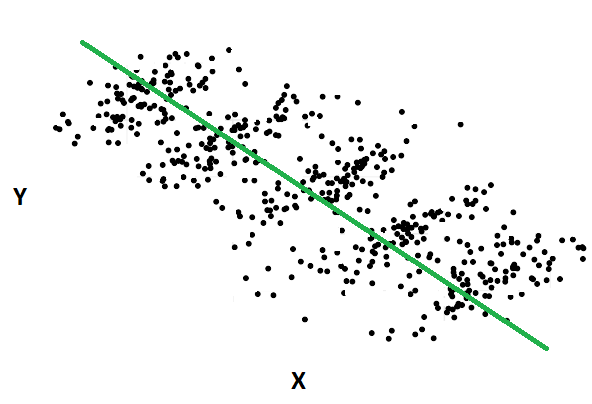
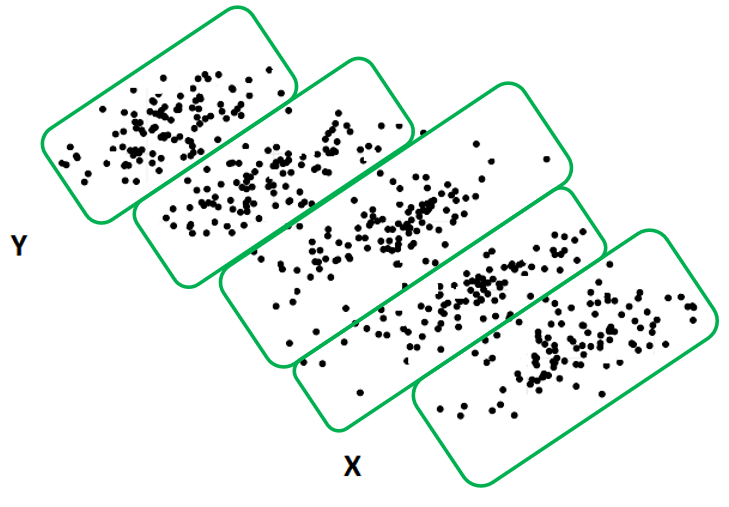

```{r setup, include=FALSE}
knitr::opts_chunk$set(fig.pos = "H", out.extra = "")
```

# Paradoja de Simpson

Podemos definir la _**paradoja de Simpson**_ como el hecho de que una asociación observada entre dos variables cualitativas cambia su sentido si, en lugar de hacerlo de manera agregada, se analiza su relación en cada uno de los subgrupos que se conforman a partir de una tercera variable cualitativa.

Es un fenómeno que a menudo se produce en el análisis estadístico cuando el estudio de las relaciones entre dos variables omite o no tiene en cuenta adecuadamente alguna información relevante para el estudio.

La paradoja de Simpson es un fenómeno estadístico que ocurre cuando combinas subgrupos en un solo grupo, de modo que el proceso de agregación de datos puede hacer que cambie la dirección aparente y la fuerza de la relación entre dos variables.

Por ejemplo, en un estudio de 1973, los datos parecían mostrar que los hombres que postulaban a todos los departamentos de la escuela de posgrado en la Universidad de Berkeley tenían más probabilidades de ser admitidos que las mujeres. En otras palabras, que existía una asociación positiva entre los hombres y la admisión. Sin embargo, cuando los analistas evaluaron las tasas de admisión por departamento, encontraron que las mujeres tenían tasas ligeramente mejores.

Comprender la paradoja de Simpson es crucial porque puede cambiar por completo los resultados, de modo que si no estamos atentos, podríamos informar accidentalmente resultados completamente inexactos. La paradoja de Simpson no es un fenómeno infrecuente en las disciplinas basadas en el análisis de datos cuantitativos, particularmente en los estudios observacionales.


## Causas de la paradoja de Simpson

La paradoja de Simpson ocurre porque una tercera variable puede afectar la relación entre un par de variables. Los estadísticos se refieren a este tipo de tercera variable como _**factor de confusión**_ (_confounder_) o _**variable de confusión**_ (_confounding variable_). Para comprender la relación correcta entre dos variables, debemos tener en cuenta la influencia de los factores de confusión.

La paradoja de Simpson ocurre cuando el proceso de agregación de datos excluye variables de confusión. Por lo general, esto sucede sin querer y los investigadores pueden no darse cuenta de las consecuencias de sus acciones.

La paradoja de Simpson es esencialmente el mismo concepto que el _**sesgo de variable omitida**_ en el análisis de regresión, excepto que es específica de los casos en los que combinamos datos e ignoramos la información de los subgrupos.

Veamos esto gráficamente antes de volver al ejemplo de admisiones. Los datos a continuación muestran un grupo que parece tener una correlación negativa entre la variable $X$ e $Y$. A medida que $X$ aumenta, $Y$ tiende a disminuir.

```{r ps_1, echo=FALSE, fig.cap="Datos agrupados", fig.align = 'center', out.width = '250px'}

```

Ahora factorizaremos los subgrupos. A continuación, es fácil ver cómo existe realmente una relación positiva entre $X$ e $Y$ después de incluir los subgrupos. Combinar los datos e ignorar los subgrupos ocultó esa relación.

```{r ps_2, echo=FALSE, fig.cap="Datos agrupados", fig.align = 'center', out.width = '250px'}

```

El conjunto de datos desglosado por subgrupos revela la verdadera relación.

En el contexto de la paradoja de Simpson, los subgrupos capturan la variable de confusión. Al agregar los datos, estamos eliminando el factor de confusión del análisis lo que distorsiona los resultados.


## Explicando el ejemplo de las admisiones

Si deseamos comparar las tasas de admisión para hombres y mujeres en la Universidad de Berkeley, parece lógico que solo baste con mirar las tasas generales. Mostramos las tasas de aceptación reales a continuación:

|             | Solicitudes | Admisiones | Rechazos | % Admisiones |
|------------:|:-----------:|:----------:|:--------:|:------------:|
| **Hombres** |    8.442    |    3.738   |   4.704  |    44,28 %   |
| **Mujeres** |    4.321    |    1.494   |   2.827  |    34,58 %   |
|   **Total** |    12.763   |    5.232   |   7.531  |    40,99 %   |

En efecto, teniendo en cuenta que la tasa global de aceptación en el conjunto de los departamentos fue de un 41 % aproximadamente, la diferencia de casi 10 puntos entre los hombres y las mujeres sería una evidencia a favor de la existencia de una discriminación por razón de género.

De hecho, si utilizamos esta tabla de contingencia para analizar su asociación, podemos afirmar que existe una relación estadísticamente significativa entre el género de los candidatos y su aceptación final en los programas de posgrado de la Universidad de Berkeley ($\chi^2$ = 111,25, df = 1, p < 0,001). Pero a pesar de ser estadísticamente significativa, esta relación no muestra una intensidad o una magnitud importante (V de Cramér = 0,09).

Así, si asumimos, y no tenemos evidencias para no hacerlo así, que las mujeres y los hombres no difieren significativamente en sus capacidades, aptitudes y habilidadesen, en un principio parece que Berkeley prefiere a los hombres y pone en desventaja a las mujeres. Sin embargo, hay más en la historia que no vemos a simple vista debido a la paradoja de Simpson.

Desafortunadamente, agregar los datos de todos los departamentos elimina las diferencias departamentales del análisis. Resulta que algunos departamentos tienen tasas de aceptación mucho más bajas que otros, es decir, son más selectivos. Los dos factores siguientes crean las tasas de aceptación engañosas y desequilibradas de la tabla anterior:

* Las mujeres tendieron a postularse para los departamentos más difíciles, lo que redujo su tasa de aceptación general.
* Los hombres se inclinaban a postularse para los departamentos más fáciles, aumentando sus tasas de aceptación.

Para determinar si el proceso de selección favorece a los hombres, necesitamos evaluar los datos a nivel departamental y comparar las tasas de aceptación dentro de cada departamento. Este método mantiene constante la tasa de aceptación de cada departamento, lo que permite comparaciones válidas.

Veamos los datos, de los 85 departamentos la tabla muestra los seis más grandes:

| Depart. | Hombres | Mujeres |
|:-------:|:-------:|:-------:|
|    A    |   62%   |   82%   |
|    B    |   63%   |   68%   |
|    C    |   37%   |   34%   |
|    D    |   33%   |   35%   |
|    E    |   28%   |   24%   |
|    F    |    6%   |    7%   |

La comparación de las tasas dentro de los departamentos muestra una imagen diferente. Las mujeres tienen una ligera ventaja sobre los hombres en la mayoría de los departamentos. Así, el análisis de subgrupos explica la variable de confusión de las diferentes tasas de admisión.


## Ejemplo de la paradoja de Simpson

La paradoja de Simpson ocurre en numerosos contextos. Más recientemente, los analistas la observaron en los informes de los medios sobre las muertes por COVID entre los vacunados y los no vacunados. En septiembre de 2022, ocurrieron 12.593 muertes por COVID en los Estados Unidos. De estos individuos, el 39% no estaba vacunado, mientras que el 61% estaba vacunado.

Resulta que la relación entre estar vacunado y tener un mayor porcentaje de muertes es una ficción creada al agregar datos y descartar información relevante fruto de la paradoja de Simpson.

En Estados Unidos, la población vacunada contra el COVID tiende a ser mayor y tiene más factores de riesgo. Este grupo, naturalmente, tiende a tener peores pronóstico de COVID. Sin embargo, cuando se ajustó por edad y otros factores de riesgo, el CDC descubrió que las personas vacunadas contra el COVID tenían un riesgo 18.6 veces menor de morir a causa del COVID, de modo que las vacunas estaban funcionando.


## Conclusión

Para concluir, la paradoja de Simpson ocurre cuando no se tiene en cuenta la información relevante al analizar los datos. Esta paradoja ocurre cuando agregamos datos y perdemos detalles esenciales en el proceso. Con el ejemplo de la inscripción, obtenemos resultados opuestos cuando observamos las tasas de aceptación generales por género, pero no consideramos las tasas de aceptación variables por departamentos. Para el ejemplo de COVID, obtenemos resultados confusos cuando evalúamos los porcentajes generales de muerte por COVID según el estado de vacunación sin tener en cuenta los factores de riesgo subyacentes.

No debería sorprender que descontar factores relevantes distorsione los resultados, pero es sorprendente lo fácil que puede suceder si no lo tenemos en cuenta.

Para evitar este tipo de confusión, los investigadores deben considerar cuidadosamente el nivel de agregación de los datos y examinar cuidadosamente los datos en busca de posibles variables de confusión que puedan influir en los resultados. Al hacer esto, pueden asegurarse de que los resultados de su estudio reflejen con precisión las tendencias y patrones subyacentes en los datos.


# Fuentes

- [_What is Simpsons Paradox?_](https://statisticsbyjim.com/basics/simpsons-paradox/)
