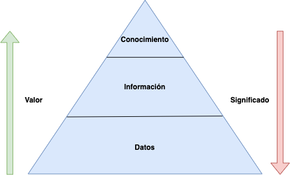
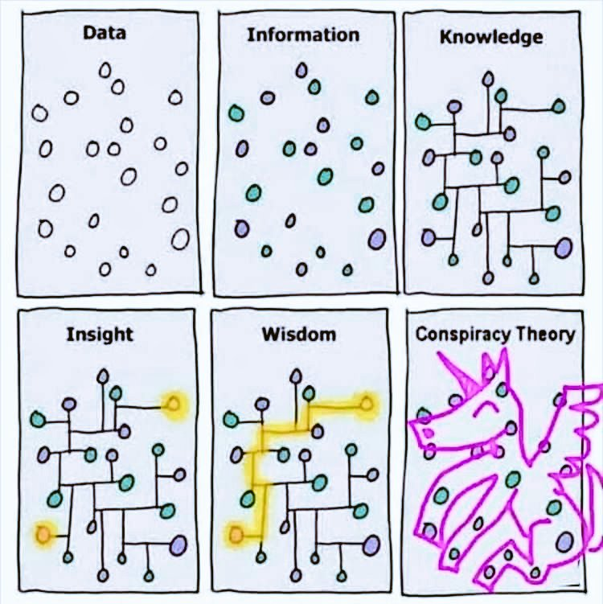

# Datos, información y conocimiento

Es un error común usar términos como datos, información y conocimiento indistintamente, ya que los tres tienen significados muy diferentes.

```{r data, echo=FALSE, fig.cap="Pirámide del conocimiento", fig.align = 'center', out.width = '300px'}

```

Dado que estas terminologías a menudo se confunden, así es como podemos distinguirlas:

## Datos

Los _**datos**_ no son más que observaciones sobre un fenómeno o aspecto limitado de la realidad que por sí solos carecen de significado. Solo cuando los ponemos en contexto les damos un sentido o significado y es entonces cuando hablamos de información.

Los datos se entienden de manera diferente en distintos sectores pero, en su forma más básica, son un conjunto de piezas fragmentadas de hechos, símbolos, cifras y caracteres cuyo significado solo se vuelve claro cuando se conectan con el contexto.

Son un conjunto discreto de valores sin procesar, que aún no han sido analizados, ni organizados, ni relacionados por lo que carecen de sentido, pero que ganan propósito y dirección una vez que se analizan e interpretan para darles un significado.

Una simple fecha, por ejemplo, es un dato que sin un propósito, una utilidad o un contexto no sirve como base para apoyar la toma de una decisión.

Recolectar y medir observaciones genera datos y, por lo general, las máquinas envían, reciben y procesan datos.

## Información

La _**información**_ son datos a los que les damos un contexto y, por tanto, les damos un sentido o significado. Los datos suelen carecer de contexto y no tienen sentido en sí mismos cuando se miran de forma individual por lo que son incomprensibles de forma independiente, mientras que la información proporciona contexto a los datos lo que nos permite entenderlos y comprender su significado. 

Para convertir los datos en información útil que nos sirva para un determinado propósito vamos a tener que estructurarlos, analizarlos e interpretarlos, es decir, vamos a procesarlos.

La información es el conjunto de datos que ya han sido procesados, estructurados, analizados e interpretados de manera significativa para volverse útiles. Una vez que los datos se procesan y organizan adquieren relevancia, se convierten en información fiable, cierta, útil y llena de significado. La información trae consigo la comprensión de los hechos y valores.

Así, la información se puede definir como un conjunto de datos procesados y que tienen un significado (relevancia, propósito y contexto). 

En última instancia, el propósito de procesar datos y convertirlos en información es ayudar a las organizaciones a tomar mejores decisiones.

La confusión entre datos e información a menudo surge porque la información está hecha de datos. Además, los datos a menudo se interpretan como hechos en el contexto del significado coloquial y, por lo tanto, se consideran información.

## Conocimiento

Los datos recopilados en un contexto significativo proporcionan información. Por el contrario, cuando la información se combina con la experiencia y la intuición da como resultado el _**conocimiento**_.

El conocimiento se deriva de la información, así como la información se deriva de los datos. 

Podemos tener todos los datos e información del mundo a nuestra disposición, que si no somos capaces de procesar los datos correctamente para convertirlos en información útil, o no tenemos la experiencia suficiente sobre un cierto tema que nos aporta el conocimiento, no seremos capaces de realizar predicciones, generalizar o tomar decisiones que aporten valor en base a esa información.

El conocimiento es una mezcla de experiencia, valores, información e intuición que hace posible tomar decisiones informadas y resolver problemas. El conocimiento influye en el pensamiento y las acciones de las personas.

La información por sí sola no es suficiente para hacer generalizaciones o predicciones sobre alguien o algo. Por el contrario, el conocimiento nos da la capacidad de predecir o hacer inferencias si poseemos la experiencia requerida.

El conocimiento connota la comprensión teórica o práctica de la información referente a un tema o materia junto con la capacidad de usarla para un propósito específico, es decir, es información útil, relevante y objetiva que ayuda a sacar conclusiones.

Aunque una persona posea una plétora de información sobre un tema en particular, esto no significa que pueda hacer un juicio o sacar inferencias sobre la base de la información disponible, porque para hacer un juicio sólido uno debe tener amplia experiencia y familiaridad con el tema, lo que solo es posible a través del conocimiento.

Mientras que la transferencia de datos e información es fácil a través de diferentes medios, la transferencia de conocimiento es más difícil porque requiere un aprendizaje por parte del receptor. Los ordenadores son muy buenos desde hace tiempo procesando datos y transfiriendo información, pero solo ahora están aprendiendo a darles sentido y generar conocimiento con la ayuda del aprendizaje automático o _machine learning_.

Así que como vemos no hay que confundir datos, información y conocimiento porque son cosas diferentes, el conocimiento lleva aparejado un aprendizaje.

Se dice que hay dos tipos de conocimiento:

* _Conocimiento implícito._ Conocimiento que no está escrito ni almacenado digitalmente. Es procedimental o forma parte de la práctica. La mayor parte del conocimiento de las organizaciones es implícito, generalmente solo reside en la memoria de las personas de la organización. Es el conocimiento colectivo que no está documentado.
* _Conocimiento explícito._ Conocimiento escrito y accesible. Puede ser en papel o en formato digital. Algunos ejemplos son los manuales o la información documentada.

```{r meme, echo=FALSE, fig.cap="Datos vs información vs conocimiento (@gapingvoid)", fig.align = 'center', out.width = '300px'}

```