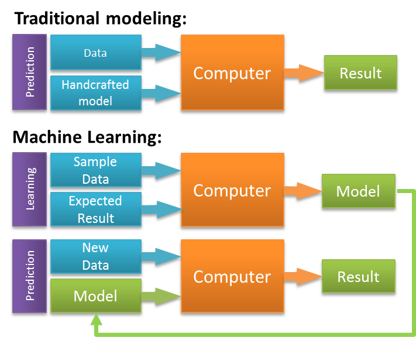

# Ciencia de datos

La _**ciencia de datos**_ _(data science)_ es la práctica de usar un conjunto de técnicas analíticas y metodologías para hacer inferencias y comunicar predicciones valiosas y justificadas a partir de datos en bruto.

La clave aquí es la palabra _**predicción**_, la habilidad de predecir es la que separa al científico de datos del analista de datos. Mientras que el analista de datos analiza el pasado, el científico de datos predice el futuro.

Pero un científico de datos no usa ninguna bola de cristal para hacer esas predicciones, sino que utiliza las matemáticas y la programación y su conocimiento sobre el dominio.

<caption><i><b>Figura 1:</b> Ciencia de datos.</i></caption>

 

Así, vamos a ver que la ciencia de datos es interdisciplinar, combina el uso de la estadística, las matemáticas y la programación para permitirnos responder preguntas muy interesantes haciendo uso de los datos en bruto.

Esta disciplina requiere tanto el uso de una batería de herramientas tecnológicas como de pensamiento crítico y conocimiento del dominio para manejar esos datos.

# Inteligencia artificial

La forma más sencilla de definir la _**inteligencia artificial**_ _(aritificial intelligence)_ es como la ciencia de hacer las cosas inteligentes, es decir, consiste en automatizar tareas que normalmente se atribuyen al pensamiento y raciocinio humano, como la resolución de problemas, la toma de decisiones y el aprendizaje.

La IA vive en la intersección de varias disciplinas clásicas, incluyendo filosofía, neurociencia, lingüística, economía, psicología, ciencias de la computación, ingeniería... Es el nombre de todo un campo del conocimiento, como la química o la biología.

Una IA no es más que alguna forma de inteligencia humana mostrada por máquinas. Aquí la palabra máquina no se refiere solamente a un robot, sino que también puede tratarse de un programa de software.

Podemos definir la _**inteligencia**_ como la habilidad de un sistema de calcular, razonar, percibir relaciones y analogías, aprender de la experiencia, guardar y recuperar información de la memoria, resolver problemas, entender ideas complejas, usar el lenguaje natural de manera fluida, clasificar, generalizar y adaptarse a nuevas situaciones.

La inteligencia es algo intangible y está compuesta por:
- _Razonamiento._ Es el conjunto de procesos que nos permiten realizar juicios, tomar decisiones y hacer predicciones. Hay dos tipos de razonamiento: inductivo y deductivo.
- _Resolución de problemas._ Es el proceso en el cual uno percibe y trata de llegar a una solución deseada desde una situación actual tomando cierto camino, el cual está bloqueado por obstáculos conocidos o desconocidos. También incluye la toma de decisiones, la cual es el proceso de seleccionar la alternativa más adecuada de entre varias para alcanzar la meta deseada.
- _Percepción._ Es el proceso de adquirir, interpretar, seleccionar y organizar información sensorial. La percepción asume sentir. En los humanos, la percepción es ayudada por los órganos de los sentidos. En el dominio de la IA el mecanismo de percepción reúne los datos adquiridos por los sensores de una manera significativa.

Todos los sistemas de IA implementados hoy en día son una forma de IA débil, es decir, pueden hacer una (o unas pocas) tareas bien definidas igual o mejor que un ser humano, pero aún estamos muy lejos de los sistemas de IA fuerte o general que nos muestran en las películas.

A día de hoy, siempre vamos a necesitar código escrito por humanos para crear un sistema capaz de aprender cosas. Una IA débil puede parecer inteligente, pero vamos a ver que por lo general no es más que una serie de cálculos matemáticos y estadísticos sofisticados, y ni mucho menos tiene conciencia, siente, ni es consciente de su propia existencia como algunas personas piensan.

Una IA para considerarse como tal debería:
- Aprender a través de los datos y hacer predicciones sobre ellos.
- Servir para automatizar procesos. Las máquinas pueden hacer tareas repetitivas muy deprisa, con mucha precisión y sin cansarse.
- Enseñarse a sí misma. Es necesario que un sistema pueda enseñarse a sí mismo porque los datos mismos cambian y el conocimiento derivado de esos datos debe ser actualizado constantemente.
- Responder en tiempo real.

Definimos _**modelado cognitivo**_ como el campo de estudio dentro de las ciencias de la computación que se encarga del estudio y simulación de procesos de pensamiento del ser humano.

# Aprendizaje automático

El _**aprendizaje automático**_ _(machine learning)_ es un subconjunto de la inteligencia artificial (IA), más concretamente una forma de IA débil que permite que las máquinas aprendan a partir de datos sin procesar.

Son un conjunto de algoritmos capaces de aproximar funciones complejas o descubrir patrones en los datos en bruto para luego hacer predicciones a partir ellos. De este modo, el aprendizaje automático implica enseñar a una máquina a reconocer patrones a través de muestras de datos, en lugar de programarla de forma explícita a través de una serie de reglas específicas.

Estos algoritmos pueden ser reutilizados para reconocer nuevos patrones usando otros datos con el mismo código, lo que es muy poderoso.

Un sistema de aprendizaje automático es inteligente porque:
1. Usa ciertos datos para ser entrenado.
2. Aprende patrones de esos datos.
3. Clasifica correctamente nuevos datos que no había visto hasta entonces basándose en el conocimiento adquirido en el paso 2.

La potencia del aprendizaje automático es que los algoritmos aprenden por sí solos de los datos que les pasamos. Por eso, aunque hoy en día un sistema de aprendizaje automático típicamente solo hace una cosa bien, como por ejemplo reconocer cierta clase de objetos, ese mismo algoritmo de aprendizaje automático puede ser reutilizado para aprender sobre nuevos objetos (pasándole suficientes datos de muestra), sin tener que reescribir el código.

Antiguamente los programadores tenían que reescribir el código para cada nuevo objeto que se quería reconocer, lo cual no era escalable. Ahora, un mismo sistema puede aprender a reconocer varios objetos distintos con simplemente mostrarle suficientes ejemplos.

Así, mientras en la programación tradicional se escribe un programa con una serie de reglas específicas a seguir, en aprendizaje automático se escribe un programa capaz de aprender a través de los datos.

Lo interesante de los sistemas o algoritmos de aprendizaje es que pueden ser reutilizados para reconocer otros patrones cuando son entrenados con otros conjuntos de datos sin tener que reescribir el código, a diferencia de lo que pasa con los sistemas basado en reglas tradicionales que si cambian la entrada el programa es tan rígido que ya no nos sirve y hay que reescribirlo.

<caption><i><b>Figura 2:</b> Programación tradicional vs aprendizaje automático.</i></caption>

 

Un modelo es solo un código que una máquina usa para convertir entradas en salidas, y puede ser creado a mano por un programador o aprendido de los datos por un algoritmo. El aprendizaje automático es un paradigma de programación completamente diferente, en el que en lugar de dar instrucciones explícitas, programamos con muestras y el algoritmo de aprendizaje automático encuentra patrones en los datos y los convierte en esas instrucciones que no podríamos escribir nosotros mismos.

Esto permite expresar nuestras instrucciones a las computadoras de una manera que antes no podíamos. De este modo la IA y el aprendizaje automático tratan de automatizar lo inefable (aquello que no se puede expresar con palabras) y nos permite explicarle a una máquina lo que queremos que haga usando ejemplos en lugar de instrucciones. Esto desbloquea una clase de tareas con las que no podíamos hacer que las computadoras nos ayudaran en el pasado porque no podíamos expresar las instrucciones. Ahora todas estas tareas se vuelven posibles de modo que el aprendizaje automático representa un salto fundamental en el progreso humano.

Imaginemos un estudiante en una clase, el cual hace un test y mira las respuestas para ver qué tal lo ha hecho. Después de puntuar su test lo vuelve a hacer y comprueba las respuestas de nuevo para ver si lo ha hecho un poco mejor. Tras miles de iteraciones, la puntuación del estudiante será muy alta. En la vida real, ningún estudiante humano aprendería de esta manera, pero las máquinas así es como lo hacen.

Aprender significa adquirir conocimientos o habilidades a través del estudio o la experiencia. Basado en esto, podemos definir el aprendizaje automático como el campo de las ciencias de la computación que proporciona a las máquinas la habilidad de aprender de los datos y mejorar a partir de la experiencia sin la necesidad de ser programado expresamente.

Debemos tener cuidado de no confundir el aprendizaje automático con la automatización, ya que esta última suele estar basada en reglas predeterminadas en el código que siempre actúan de la misma manera y no permite aprender de los datos. Lo que sí que es cierto es que puede ayudar a automatizar ciertos procesos.

Otro aspecto a tener en cuenta es que el aprendizaje automático carece de poder de razonamiento, por lo que no es bueno a la hora de generalizar el conocimiento. Así, si un modelo es entrenado para resolver una tarea, por ejemplo identificar gatos en imágenes, deberá ser entrenado de nuevo para, por ejemplo, reconocer personas.

## Componentes del aprendizaje automático

Para enseñar a las máquinas necesitamos 3 elementos:

1. _**Datos**_. Cuanto más diversos sean los datos mejor serán los resultados. Hay dos formas de recolectar los datos: manual y automática. Los datos recolectados manualmente tienen muchos menos errores pero se tarda más tiempo en obtenerlos, lo que los hace más caros.
2. _**Características**_. También conocidas como parámetros, atributos o variables, son los factores en los que el sistema de aprendizaje automático se tiene que fijar. Cuando los datos están almacenados en tablas es sencillo, los atributos son las columnas.
3. _**Algoritmos**_. Cada problema puede resolverse de diferentes maneras y el método elegido afecta a la precisión, el rendimiento y el tamaño del modelo final. Pero si los datos son malos ni el mejor algoritmo puede ayudar.

<caption><i><b>Figura 3:</b> Componentes del  aprendizaje automático.</i></caption>

 

La elección del algoritmo depende principalmente de 3 factores:
* La calidad de los datos de entrada. Ningún dataset es perfecto, en la vida real están plagados de problemas como ruido, datos que faltan, datos atípicos, ausencia de datos suficientes para entrenar... lo que va a condicionar el algoritmo que podemos usar.
* El tipo de salida que se necesita, la cual está directamente relacionado con la clase de preguntas de negocio que necesitamos responder.
* Las limitaciones del negocio. Estas vienen en forma de costes, tiempo para obtener un rendimiento (_time-to-market_), consumo de recursos de los dispositivos, infraestructura disponible, nivel de precisión requerido, necesidad de interpretabilidad...

# Aprendizaje profundo

Por último, el _**aprendizaje profundo**_ _(deep learning)_ no es más que una técnica de aprendizaje automático que hace uso de un tipo especial de algoritmos organizados en capas conocido como _**redes neuronales**_ y, en concreto, aquellas con muchas capas.

<caption><i><b>Figura 4:</b> Inteligencia artificial vs aprendizaje automático.</i></caption>

 

# Citas curiosas

A continuación, recopilo algunas de las citas más famosas relacionadas con la ciencia de datos:

> _"If you torture the data long enough, it will confess."_ – Ronald H. Coase

> _"Data is not information, Information is not knowledge, Knowledge is not understanding, Understanding is not wisdom."_ – Clifford Stoll

> _"If we have data, let's look at data. If all we have are opinions, let's go with mine."_ – James Love Barksdale

> _"You should know a word by the company it keeps"_ – John Rupert Firth

> _"In God we trust. All others must bring data."_ – W. Edwards Deming

> _"We started with open source 'code' contribution. Now we are at a phase where we do open source 'model' contribution."_ – Unknown

# Fuentes

- [Machine Learning for Everyone](https://vas3k.com/blog/machine_learning/)
- [Machine Learning - Zeiss](https://blogs.zeiss.com/digital/the-relation-between-computer-vision-and-machine-learning/machine-learning/)
- [Traditional Programming vs Machine Learning](https://sravya-tech-usage.medium.com/traditional-programming-vs-machine-learning-e9bbed5e491c)
