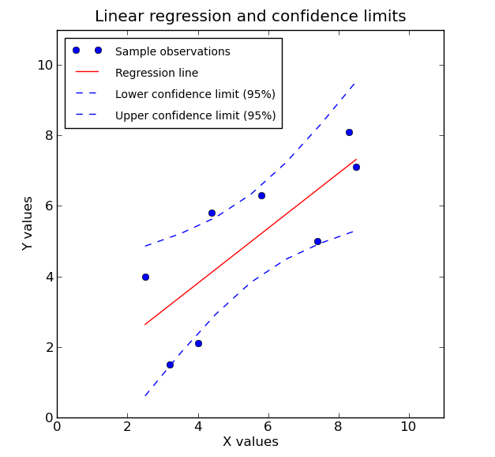

```{r setup, include=FALSE}
knitr::opts_chunk$set(fig.pos = "H", out.extra = "")
```

# Estadística

El campo de la _**estadística**_ es la ciencia de aprender de los datos, y consiste en un conjunto de métodos para recolectar, organizar, analizar, interpretar y representar los datos y los resultados de dicho análisis de forma eficaz. La estadística es un proceso crucial a la hora demostrar o refutar teorías científicas o hipótesis, tomar decisiones basadas en datos y hacer predicciones.

Entendemos por _**datos**_ hechos o fragmentos de información que podemos recolectar. Las estadísticas usan evidencias numéricas para sacar conclusiones válidas a partir de esos datos.

```{r stats, echo=FALSE, fig.cap="Estadística", fig.align = 'center', out.width = '100px'}

```

Cuando usamos correctamente los procedimientos estadísticos tendemos a producir resultados precisos. De hecho, los análisis estadísticos dan cuenta de la incertidumbre y el error en los resultados.

Los estadísticos se aseguran de que todos los aspectos de un estudio sigan los métodos apropiados para producir resultados fiables. Estos métodos incluyen:

* Obtener datos fiables
* Analizar los datos adecuadamente
* Sacar conclusiones razonables

El uso de análisis estadísticos para producir hallazgos para un estudio es la culminación de un largo proceso. Este proceso incluye la construcción del diseño del estudio, la selección y medición de las variables, el diseño de la técnica de muestreo y el tamaño de la muestra, la limpieza de los datos y la determinación de la metodología de análisis, entre muchas otras cuestiones.

La calidad general de los resultados depende de toda la cadena de eventos y un solo eslabón débil podría producir resultados poco fiables. La siguiente lista proporciona una pequeña muestra de los posibles problemas y errores analíticos que pueden afectar un estudio:

* _Exactitud y precisión._ Antes de recopilar datos, debemos asegurarnos de la exactitud y precisión del sistema de medición. Después de todo, si no podemos confiar en nuestros datos no podemos confiar en los resultados.
* _Muestras sesgadas._ Una muestra extraída incorrectamente puede sesgar las conclusiones desde el principio.
* _Generalización excesiva._ Los hallazgos de una población pueden no aplicarse a otra población. Desafortunadamente, no está necesariamente claro qué diferencia a una población de otra. Las inferencias estadísticas siempre son limitadas, y debemos comprender las limitaciones.
* _Causalidad._ Cuando $A$ precede a $B$, y $A$ está correlacionado con $B$, deberemos usar un diseño experimental que incluya asignación aleatoria para asumir con confianza si los resultados representan causalidad o solo correlación.
* _Análisis incorrecto._ Podemos utilizar una amplia gama de herramientas analíticas, pero no todas son correctas para una situación específica.
* _Violar los supuestos de un análisis._ La mayoría de los análisis estadísticos tienen supuestos. Estas suposiciones a menudo involucran propiedades de la muestra, las variables, los datos y el modelo. Cuando violamos una suposición importante, corremos el riesgo de producir resultados engañosos.
* _Minería de datos._ Incluso cuando los analistas hacen todo lo demás correctamente, pueden producir resultados falsos significativos al investigar un conjunto de datos durante demasiado tiempo. Cuando los analistas realizan muchas pruebas, algunas serán estadísticamente significativas debido a patrones aleatorios en los datos. Por eso, es necesario rastrear el número de pruebas realizadas durante un estudio y colocar los resultados en el contexto adecuado.

Los análisis estadísticos se utilizan en casi todos los campos para dar sentido a la gran cantidad de datos disponibles.

Los analistas sin escrúpulos pueden utilizar una metodología incorrecta para sacar conclusiones injustificadas y, si no estamos familiarizado con las estadísticas, estas manipulaciones pueden ser difíciles de detectar. El conocimiento estadístico es la solución a este problema, ya que nos sirve para protegernos de la manipulación y para reaccionar a la información de manera inteligente.

Las estadísticas descriptivas e inferenciales son dos categorías amplias en el campo de la estadística, ambos tipos de estadísticas son importantes para diferentes propósitos. Aunque algunas de las medidas estadísticas son similares, los objetivos y las metodologías son muy diferentes en ambos casos.


## Estadística descriptiva

Las _**estadísticas descriptivas**_ sirven para resumir y graficar las propiedades de los datos de un grupo que elijamos, es decir, describen una muestra. Este proceso nos permite comprender ese conjunto específico de observaciones.

Con las estadísticas descriptivas no hay incertidumbre porque estamos describiendo solo a las personas o elementos que realmente medimos, es decir, no estamos tratando de inferir propiedades sobre una población más grande.

El proceso implica tomar una cantidad potencialmente grande de puntos de datos en la muestra y reducirlos a unos pocos valores y gráficos de resumen significativos. Este procedimiento nos permite visualizar los datos y obtener más información que simplemente analizando fila tras fila de datos sin procesar.

En la estadística descriptiva, el _**resumen estadístico**_ _(summary statistics)_ se utiliza para resumir un conjunto de observaciones, con el fin de comunicar la mayor cantidad de información de la manera más sencilla posible. Así, a los estadísticos y científicos de datos generalmente no les gusta trabajar con grandes cantidades de números y de información, por lo que intentan resumir los datos mediante un pequeño conjunto de cifras usando lo que se conoce como resumen estadístico.

Así, si tenemos un conjunto de medidas del mundo real podemos comprimir la información de esas medidas en unas pocas cantidades que luego podamos usar para comparar. Debido a nuestra limitada capacidad cognitiva, no podemos repasar esas medidas una por una para hacer comparaciones, necesitamos resumir esos números y es por eso que tenemos estadísticas descriptivas.

Las estadísticas descriptivas utilizan con frecuencia las siguientes medidas estadísticas o herramientas para describir grupos o muestras:

* Una medida de localización o tendencia central. Usaremos medidas como la media o la mediana para ubicar el centro del conjunto de datos. Esta medida nos dice dónde caen la mayoría de los valores.
* Una medida de dispersión. ¿A qué distancia del centro se extienden los datos? Podemos usar medidas como el rango o la desviación estándar para medir la dispersión. Una baja dispersión indica que los valores se agrupan más estrechamente alrededor del centro. Una mayor dispersión significa que los puntos de datos se alejan más del centro. También podemos graficar la distribución de frecuencias.
* Una medida de la forma de la distribución como el sesgo _(skewness)_ o kurtosis. Nos dice si la distribución de valores es simétrica o está sesgada y su propensión a tener valores atípicos.
* Si se mide más de una variable, una medida de la dependencia estadística o relación entre ellas como el coeficiente de correlación.

Un conjunto de estadísticas que se utilizan como estadísticas de resumen de forma habitual es el _**resumen de cinco números**_ _(five number summary)_ que presenta un conjunto de propiedades de distribución para la muestra, a veces extendido a un resumen de siete números, y el diagrama de caja asociado. Así, podemos presentar toda esta información resumida usando números y gráficos.

```{r boxplot, echo=FALSE, fig.cap="Diagrama de caja", fig.align = 'center', out.width = '300px'}
knitr::include_graphics("img/interquartile_range_1.png")
```

En la teoría estadística, la localización y la variabilidad se conocen como el primer y segundo momento de una distribución. Los momentos tercero y cuarto se denominan asimetría _(skewness)_ y kurtosis _(kurtois)_. La asimetría se refiere a si los datos están sesgados hacia valores más grandes o más pequeños, y la kurtosis indica la propensión de los datos a tener valores extremos. Generalmente, no se utilizan métricas para medir la asimetría y la kurtosis, en cambio, estos se descubren a través de representaciones gráficas.


## Estadística inferencial

La _**estadística inferencial**_ es una parte de la estadística que comprende los métodos y procedimientos que por medio de la inducción determinan propiedades de una población estadística a partir de una parte de esta o muestra.

Así, los estadísticos se refieren al proceso de usar muestras para estimar las propiedades de poblaciones enteras como estadísticas inferenciales.

La estadística inferencial toma datos de una muestra y hace inferencias sobre la población más grande de la que se extrajo la muestra. Debido a que el objetivo de la estadística inferencial es sacar conclusiones de una muestra y generalizarlas a una población, debemos tener confianza en que nuestra muestra refleja con precisión a la población.

```{r pm, echo=FALSE, fig.cap="Población vs muestra", fig.align = 'center', out.width = '200px'}
knitr::include_graphics("img/population_vs_sample.png")
```

A un nivel amplio, debemos hacer lo siguiente:

1. Definir la población que estamos estudiando.
2. Extraer una muestra representativa de esa población.
3. Utilizar análisis que incorporen el error de muestreo.

No podemos elegir el grupo que nos conveniente, el muestreo aleatorio nos permite confiar en que la muestra representa a la población. Usando una muestra aleatoria, podemos generalizar a partir de la muestra a una población más amplia. Desafortunadamente, recolectar una muestra verdaderamente aleatoria puede ser un proceso complicado.

Existen diferentes métodos de muestreo para recolectar una muestra representativa: muestreo aleatorio simple, muestreo estratificado, muestreo sistemático, etc.

Vamos a obtener enormes beneficios al trabajar con una muestra aleatoria extraída de una población. De hecho, en la mayoría de los casos, es simplemente imposible medir toda la población para comprender sus propiedades. La alternativa es reunir una muestra aleatoria y luego utilizar metodologías de estadística inferencial para analizar los datos de la muestra.

Si bien las muestras son mucho más prácticas y menos costosas a la hora de trabajar, existen desventajas. Por lo general, aprendemos sobre la población extrayendo una muestra relativamente pequeña de ella, de modo que estamos muy lejos de medir todas las personas u objetos de esa población. En consecuencia, cuando estimamos las propiedades de una población a partir de una muestra, es poco probable que las estadísticas de la muestra equivalgan exactamente al valor real de la población.

Por ejemplo, es poco probable que la media de nuestra muestra sea exactamente igual a la media de la población. La diferencia entre la estadística de la muestra y el valor de la población es el _**error de muestreo**_. Las estadísticas inferenciales incorporan estimaciones de este error en los resultados estadísticos.

Por el contrario, los valores de resumen en las estadísticas descriptivas son los reales. El valor promedio en una clase específica es un valor conocido porque medimos a todos los individuos en esa clase. No hay incertidumbre.

Las metodologías más comunes en estadística inferencial son las pruebas de hipótesis, los intervalos de confianza y el análisis de regresión. Curiosamente, estos métodos inferenciales pueden producir valores de resumen similares a los de las estadísticas descriptivas, como la media y la desviación estándar. Sin embargo, los usamos de manera muy diferente cuando hacemos inferencias.

### Pruebas de hipótesis

Las _**pruebas de hipótesis**_ usan datos de muestra para responder preguntas como las siguientes: ¿La media de la población es mayor o menor que un valor particular? ¿Son las medias de dos o más poblaciones diferentes entre sí?

Por ejemplo, si estudiamos la efectividad de un nuevo medicamento al comparar los resultados en un grupo de tratamiento y control, las pruebas de hipótesis pueden decirnos si es probable que el efecto del fármaco que observamos en la muestra se dé en la población. Las pruebas de hipótesis nos permiten sacar este tipo de conclusiones sobre poblaciones enteras.

### Intervalos de confianza

En las estadísticas inferenciales, un objetivo principal es estimar los parámetros de la población. Estos parámetros son los valores desconocidos para toda la población, como la media de la población y la desviación estándar. Estos valores de parámetros no solo son desconocidos, sino que casi siempre son incognoscibles. Por lo general, es imposible medir una población completa. El error de muestreo produce incertidumbre, o un margen de error, en torno a nuestras estimaciones.

Supongamos que definimos nuestra población como todos los jugadores de baloncesto de la escuela secundaria. Luego, extraemos una muestra aleatoria de esta población y calculamos una altura media de 181 cm. Esta estimación de muestra de 181 cm es la mejor estimación de la altura media de la población. Sin embargo, está prácticamente garantizado que nuestra estimación del parámetro de población no es exactamente correcta.

Los _**intervalos de confianza**_ incorporan la incertidumbre y el error de muestreo para crear un rango de valores dentro del cual el valor de la población real parece estar dentro. En nuestro ejemplo, un intervalo de confianza de [176 186] indicaría que podemos estar seguros de que la media de la población real se encuentra dentro de este rango.

### Análisis de regresión

El _**análisis de regresión**_ describe la relación entre un conjunto de variables independientes y una variable dependiente. Este análisis incorpora pruebas de hipótesis que ayudan a determinar si las relaciones observadas en los datos de la muestra realmente existen en la población.

Si tenemos una gráfica que muestra la relación en el modelo de regresión entre dos variables para una muestra, y si la relación es estadísticamente significativa, tenemos evidencia suficiente para concluir que esta relación existe en la población y no solo en la muestra.

```{r rl, echo=FALSE, fig.cap="Regresión lineal", fig.align = 'center', out.width = '250px'}

```

Como podemos ver, la diferencia entre las estadísticas descriptivas y las inferenciales radica tanto en el proceso como en las estadísticas que informa.

Para las estadísticas descriptivas, elegimos un grupo que queremos describir y luego medimos todos los sujetos en ese grupo. El resumen estadístico describe este grupo con total certeza (fuera de error de medición).

Para las estadísticas inferenciales, necesitamos definir la población y luego diseñar un plan de muestreo que produzca una muestra representativa. Los resultados estadísticos incorporan la incertidumbre inherente al uso de una muestra para comprender una población completa. El tamaño de la muestra se convierte en una característica vital. La _**Ley de los grandes números**_ establece que a medida que crece el tamaño de la muestra, las estadísticas de la muestra convergerán en el valor de la población.

Un estudio que utiliza estadísticas descriptivas es más sencillo de realizar. Sin embargo, si necesitamos evidencia de que existe un efecto o una relación entre las variables en una población completa en lugar de solo en su muestra, debemos usar estadísticas inferenciales.


# Fuentes

- [_Difference between Descriptive and Inferential Statistics_](https://statisticsbyjim.com/basics/descriptive-inferential-statistics/)
