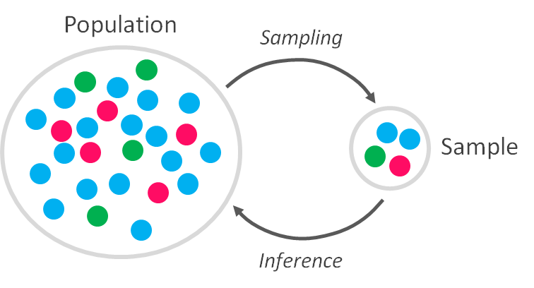

```{r setup, include=FALSE}
knitr::opts_chunk$set(fig.pos = "H", out.extra = "")
```

# Poblaciones y muestras

Las _**estadísticas inferenciales**_ nos permiten sacar conclusiones sobre las poblaciones mediante el uso de muestras más pequeñas. En consecuencia, las estadísticas inferenciales brindan enormes beneficios porque, por lo general, no se puede medir una población completa.

```{r stats, echo=FALSE, fig.cap="Estadística", fig.align = 'center', out.width = '350px'}

```

Sin embargo, para obtener estos beneficios, debemos comprender la relación entre poblaciones, subpoblaciones, parámetros de población, muestras y estadísticas de las muestras.

Una _**muestra**_ _(sample)_ es un subconjunto de datos de un conjunto de datos más grande; los estadísticos llaman a este conjunto de datos más grande la _**población**_ _(population)_. La población es el conjunto de individuos que se quiere estudiar, es decir, la totalidad de los individuos, mientras que la muestra es una parte cualquiera de la población.

Así, una muestra es un subconjunto de observaciones de la población que idealmente es una representación real de las características o atributos de esa población. Los resultados que obtendremos de estudiar la muestra serán más fiables cuanto más representativa sea la muestra, es decir, cuanto más reproduzca, a una escala más reducida, la estructura y composición de la población. Existen diferentes _**técnicas de muestreo**_ o alternativas a la hora de seleccionar muestras a partir de poblaciones.

Los estadísticos se refieren a los diversos procesos de extracción de subconjuntos de poblaciones como métodos de muestreo. Idealmente, estas técnicas producen muestras representativas con características que se parecen al conjunto completo de sujetos. Las muestras representativas son mejores para los investigadores que desean generalizar sus resultados a la población.

Cada uno de los diversos métodos tiene un conjunto de pros y contras. Generalmente, los procedimientos más costosos y complejos son mejores a la hora de obtener muestras representativas. Los enfoques menos costosos tienden a generar sesgos, lo que los hace menos generalizables.

En resumen, generalmente existe una compensación entre representatividad y costo. Los métodos de muestreo probabilístico son mejores para la representatividad e incluyen los siguientes tipos: muestreo aleatorio simple, muestreo sistemático y muestreo por conglomerados.

Los procedimientos no probabilísticos suelen ser más convenientes y económicos, pero tienden a producir resultados sesgados y no representativos, lo que limita la generalización. Estos métodos incluyen los siguientes tipos: muestreo por conveniencia, muestreo por cuotas y muestreo de bola de nieve.

Una población en estadística no es lo mismo que en biología: es un conjunto de datos grande y definido (pero a veces teórico o imaginario) formado por todos los elementos cuyas características se están estudiando. Las poblaciones pueden incluir individuos, objetos, eventos, etc.

En estadística, hay dos tipos generales de poblaciones:

* Las poblaciones pueden ser el conjunto completo de todos los elementos similares que existen. Por ejemplo, la población de un país incluye a todas las personas que se encuentran actualmente en ese país. Es una lista finita pero potencialmente grande de miembros. 
* Una población también puede ser una construcción teórica que es potencialmente infinita en tamaño. Por ejemplo, los analistas de mejora de la calidad a menudo consideran que toda la producción actual y futura de una línea de fabricación es parte de una población.

Las poblaciones comparten un conjunto de atributos que nosotros definimos. Por ejemplo, las siguientes son poblaciones: las estrellas en la galaxia de la Vía Láctea, las piezas de una línea de producción o los ciudadanos de España.

Dado que experimentar con una población completa es imposible o simplemente demasiado costoso, los investigadores o analistas usan muestras en lugar de la población completa en sus experimentos o ensayos. Para asegurarse de que los resultados experimentales sean fiables y válidos para toda la población, la muestra debe ser una representación real de la población, es decir, la muestra debe ser imparcial y no estar sesgada.

Antes de comenzar un estudio, debemos definir cuidadosamente la población que estamos estudiando. Estas poblaciones se pueden definir de forma restringida para satisfacer las necesidades del análisis. Por ejemplo, mujeres suecas adultas que por lo demás están sanas pero tienen osteoporosis.

Las _**subpoblaciones**_ _(subpopulation)_ comparten atributos adicionales. Por ejemplo, la población de los Estados Unidos contiene las subpoblaciones de hombres y mujeres. También podemos subdividirlo de otras formas, como región, edad, nivel socioeconómico, etc. Diferentes estudios que involucran a la misma población pueden dividirla en diferentes subpoblaciones según lo que tenga sentido para los datos y los análisis.

Comprender las subpoblaciones en el estudio nos ayuda a comprender el tema más a fondo. También puede ayudarnos a producir modelos estadísticos que se ajusten mejor a los datos. Las subpoblaciones son particularmente importantes cuando tienen características que son sistemáticamente diferentes a la población general. Cuando analizamos los datos, debemos ser conscientes de estas divisiones más profundas. De hecho, podemos tratar las subpoblaciones relevantes como factores adicionales en análisis posteriores.

Por ejemplo, si estamos analizando la estatura promedio de los adultos en los Estados Unidos, mejoraremos los resultados al incluir subpoblaciones masculinas y femeninas porque sus estaturas son sistemáticamente diferentes.

Supongamos que estamos estudiando la altura de los ciudadanos estadounidenses y supongamos además que no sabemos mucho sobre el tema. En consecuencia, recolectamos una muestra aleatoria, medimos las alturas en centímetros y calculamos la media y la desviación estándar de la muestra.

Obtenemos los siguientes resultados:

```{r}
data <- read.csv("data/heights_by_gender.csv")
head(data)
```

```{r}
library(ggplot2)

ggplot(data, aes(x = Heights)) +
       geom_histogram(position = "identity", bins = 20, alpha = 0.4)
```

```{r}
mean <- round(mean(data$Heights), 2)
st_dv <- round(sd(data$Heights), 2)

sprintf("Mean - %s", mean)
sprintf("Standard deviation - %s", st_dv)
```

Debido a que hemos reunido una muestra aleatoria, podemos suponer que estas estadísticas de muestra son estimaciones no sesgadas de los parámetros de la población.

Ahora, supongamos que aprendemos más sobre el área de estudio e incluimos hombres y mujeres como subpoblaciones. Obtenemos los siguientes resultados:

```{r}
ggplot(data, aes(x = Heights, fill = Gender)) +
       geom_histogram(position = "identity", bins = 20, alpha = 0.4)
```

```{r}
data_f <- data[data$Gender == "Female",]
data_m <- data[data$Gender == "Male",]

data_s <- list('Mean' = c(mean(data_f$Heights), mean(data_m$Heights)),
               'StDev' = c(sd(data_f$Heights), sd(data_m$Heights)))
data_s <- as.data.frame(do.call(cbind, data_s), 
                        row.names = c("Female", "Male"))
data_s
```

Ahora, la única distribución amplia ha sido reemplazada por dos distribuciones más reducidas. La distribución para cada género tiene una desviación estándar más pequeña que la distribución única para todos los adultos, lo que es consistente con la distribución más limitada alrededor de las medias tanto para hombres como para mujeres en el gráfico. Estos resultados muestran cómo la media proporciona estimaciones más precisas cuando evaluamos las alturas por género. De hecho, la media de toda la población no es igual a la media de ninguna de las subpoblaciones, lo que es engañoso.

Durante este proceso, aprendemos que el género es una subpoblación crucial que se relaciona con la altura y aumenta nuestra comprensión del tema. En futuros estudios sobre la altura, podemos incluir el sexo como variable predictora.

Este ejemplo utiliza una variable de agrupación categórica (`Gender`) y una variable de salida continua (`Heights`). Cuando deseemos comparar distribuciones de valores continuos entre grupos como en este ejemplo, debemos considerar usar diagramas de caja. Estos gráficos se vuelven más útiles a medida que aumenta el número de grupos.

Este ejemplo es intencionalmente fácil de entender, pero imaginemos un estudio sobre un tema menos obvio. Este proceso nos ayudará a obtener información nueva y producir mejores modelos estadísticos.

Un _**parámetro**_ _(parameter)_ es un valor que describe una característica de toda una población, como la media de la población. Debido a que casi nunca se puede medir una población completa, por lo general no se conoce el valor real de un parámetro. De hecho, los valores de los parámetros son casi siempre desconocidos. Si bien no conocemos el valor, definitivamente existe.

Por ejemplo, la estatura promedio de las mujeres adultas en los Estados Unidos es un parámetro que tiene un valor exacto, simplemente no sabemos cuál es.

La media poblacional y la desviación estándar son dos parámetros comunes. En estadística, los símbolos griegos suelen representar parámetros de población, como $\mu$ (mu) para la media y $\sigma$ (sigma) para la desviación estándar.

Una _**estadística**_ _(statistic)_ es una característica de una muestra. Si recolectamos una muestra y calculamos la media y la desviación estándar, estas son estadísticas de la muestra. Las estadísticas inferenciales nos permiten usar estadísticas de muestra para sacar conclusiones sobre una población. Sin embargo, para sacar conclusiones válidas, debemos usar técnicas de muestreo particulares. Estas técnicas ayudan a garantizar que las muestras produzcan estimaciones imparciales. Las estimaciones sesgadas son sistemáticamente demasiado altas o demasiado bajas. Deseamos estimaciones imparciales porque son correctas en promedio.

En las estadísticas inferenciales, usamos estadísticas muestrales para estimar los parámetros de la población, la cual se supone que sigue una distribución subyacente pero desconocida. Todo lo que está disponible son los datos de la muestra y su distribución empírica. Por ejemplo, si recolectamos una muestra aleatoria de mujeres adultas en los Estados Unidos y medimos sus estaturas, podemos calcular la media de la muestra y usarla como una estimación no sesgada de la media de la población. También podemos realizar pruebas de hipótesis en la estimación de la muestra y crear intervalos de confianza para construir un rango en el que probablemente se encuentre el valor real de la población.

La ley de los grandes números establece que a medida que crece el tamaño de la muestra, las estadísticas de la muestra convergerán en los parámetros de la población. Además, el error estándar de la media describe matemáticamente cómo muestras más grandes producen estimaciones más precisas.

Usando nuestro conocimiento de poblaciones, subpoblaciones, parámetros, muestreo y estadísticas de muestra, podemos sacar conclusiones valiosas sobre poblaciones grandes usando muestras pequeñas.

Cuando tomemos medidas, debemos asegurarnos de que nuestros instrumentos de medición y las puntuaciones de las pruebas sean válidos (validez).

## Parámetros vs estadísticas

Como hemos comentado, los parámetros son números que describen las propiedades de poblaciones enteras, mientras que las estadísticas son números que describen las propiedades de las muestras.

Por ejemplo, el ingreso promedio de los Estados Unidos es un parámetro de población. Por el contrario, el ingreso promedio para una muestra extraída de los EE.UU. es una estadística muestral. Ambos valores representan el ingreso medio, pero uno es un parámetro frente a una estadística.

Una población es el grupo completo de personas, objetos, animales, transacciones, etc., que estamos estudiando. Una muestra es una porción de la población.

Los parámetros y las estadísticas usan números para resumir las propiedades de una población o muestra. Existe una gama de posibles atributos que podemos evaluar, lo que da lugar a varios tipos de parámetros y estadísticas.

Cuando medimos una característica utilizando una escala continua, podemos calcular varios valores de resumen para estadísticas y parámetros, como medias, medianas, desviaciones estándar y correlaciones.

Cuando la característica es categórica, el parámetro o estadística a menudo será una proporción, como la proporción de personas que están de acuerdo con una ley en particular.

Si bien los parámetros y las estadísticas tienen los mismos tipos de valores de resumen, los estadísticos los denotan de manera diferente. Por lo general, usamos letras griegas y latinas mayúsculas para indicar parámetros y letras latinas minúsculas para representar estadísticas.

|      Valor de resumen     | Parámetro | Estadística |
|--------------------------:|:---------:|:-----------:|
| **Media**                 | $\mu$     | $\bar{x}$   |
| **Desviación estándar**   | $\sigma$  | s           |
| **Correlación**           | $\rho$    | r           |
| **Proporción**            | P         | $\hat{p}$   |


En los ejemplos a continuación, observamos cómo el mismo sujeto y valor de resumen puede ser un parámetro o una estadística. La diferencia depende de si el valor resume una población o una muestra.

| Parámetro                                                                         | Estadística                                                                              |
|-----------------------------------------------------------------------------------|------------------------------------------------------------------------------------------|
| Peso medio de todos los pastores alemanes.                                         | Peso medio de una muestra aleatoria de 200 pastores alemanes.                             |
| Ingreso medio de un condado.                                                       | Ingreso medio de una muestra aleatoria de 50 de ese condado.                              |
| Desviación estándar de todos los tiempos de transacción en un banco en particular. | Desviación estándar de una muestra aleatoria de 500 tiempos de transacción en ese banco. |
| Proporción de todas las personas que prefieren Coca-Cola a Pepsi.                  | Proporción de una muestra aleatoria de 100 personas que prefieren Coca-Cola a Pepsi.      |

Si estamos escuchando las noticias, leyendo un informe o realizando un examen de estadística, ¿cómo sabemos si un valor de resumen es un parámetro o una estadística?

Los estudios del mundo real casi siempre funcionan con estadísticas porque las poblaciones tienden a ser demasiado grandes para medirlas por completo. Recordemos que para encontrar el valor exacto de un parámetro debemos poder medir la población completa.

Sin embargo, los investigadores definen las poblaciones para sus estudios y pueden especificar una muy definida. Por ejemplo, un investigador podría definir la población como un vecindario específico, senadores estadounidenses ($n=100$) o un equipo deportivo en particular. En estos casos es totalmente posible encuestar a la totalidad de esas poblaciones.

El truco consiste en determinar si el valor de resumen se aplica a toda una población o a una muestra de una población. Tendremos en consideración los siguientes puntos:

* Una descripción que especifica el uso de una muestra indica que el valor de resumen es una estadística.
* Si la población es muy grande o imposible de medir por completo, el valor de resumen es una estadística.
* Sin embargo, si los investigadores definen a la población como un grupo relativamente pequeño que es razonablemente accesible, los investigadores podrían medir potencialmente a todo el grupo. En este caso el valor de resumen puede ser un parámetro.

Los investigadores suelen estar más interesados en comprender los parámetros de la población. Después de todo, comprender las propiedades de una muestra relativamente pequeña no es valioso por sí mismo. Por ejemplo, a los científicos no les importa el efecto medio de un nuevo medicamento en unas pocas personas, que es una estadística de muestra. En cambio, quieren comprender su efecto medio en toda la población, un parámetro.

Desafortunadamente, medir una población completa para calcular exactamente su parámetro suele ser imposible porque son demasiado grandes. Así, no nos queda más remedio que usar muestras y sus estadísticas. Afortunadamente, con las estadísticas inferenciales, los analistas pueden usar estadísticas de muestra para estimar los parámetros de la población, lo que ayuda al progreso de la ciencia.

El uso de una estadística de muestra para estimar un parámetro de población es un proceso que comienza con el uso de un método de muestreo que tiende a producir muestras representativas, es decir, una muestra con atributos similares a los de la población. Los científicos utilizan con frecuencia el muestreo aleatorio. Luego, los analistas pueden usar varios análisis estadísticos que toman en cuenta el error de muestreo para estimar el parámetro de la población.

Las estadísticas muestrales estiman el valor del parámetro de la población, pero la estimación nunca es igual al parámetro exactamente. En consecuencia, siempre hay un margen de error en torno a las estimaciones de la muestra.

El error de muestreo es la diferencia entre el valor correcto de la población y la estimación de la muestra. Desafortunadamente, los analistas nunca saben la cantidad del error de muestreo de forma exacta porque no conocen el valor del parámetro, pero los métodos estadísticos pueden estimarlo. Puede ser difícil de asimilar, pero las estadísticas de muestra siempre son incorrectas (hasta cierto punto).

Los intervalos de confianza y los márgenes de error son dos métodos para estimar el error de muestreo.

# Fuentes

- [_Population vs Sample: Uses and Examples_](https://statisticsbyjim.com/basics/population-vs-sample/)
- [_Parameter vs Statistic: Examples & Differences_](https://statisticsbyjim.com/basics/parameter-vs-statistic/)
- [_Populations, Parameters, and Samples in Inferential Statistics_](https://statisticsbyjim.com/basics/populations-parameters-samples-inferential-statistics/)