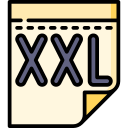
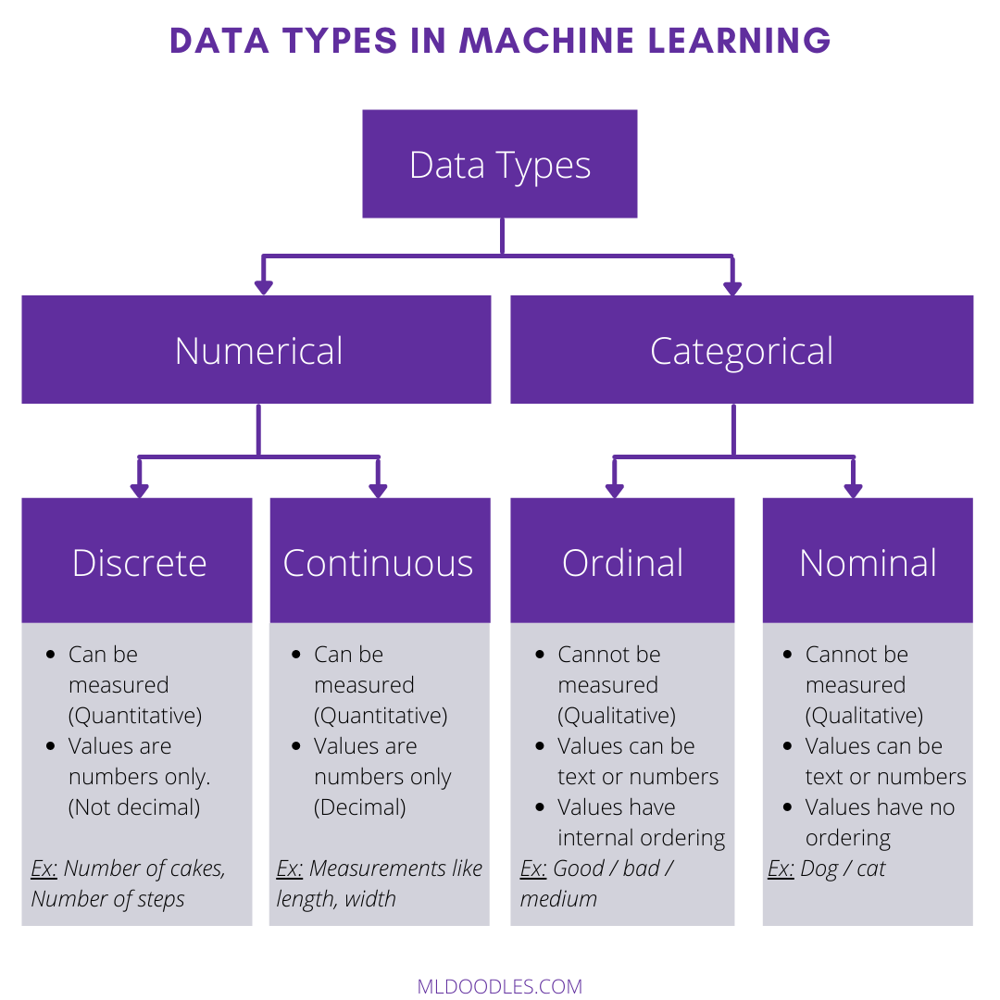
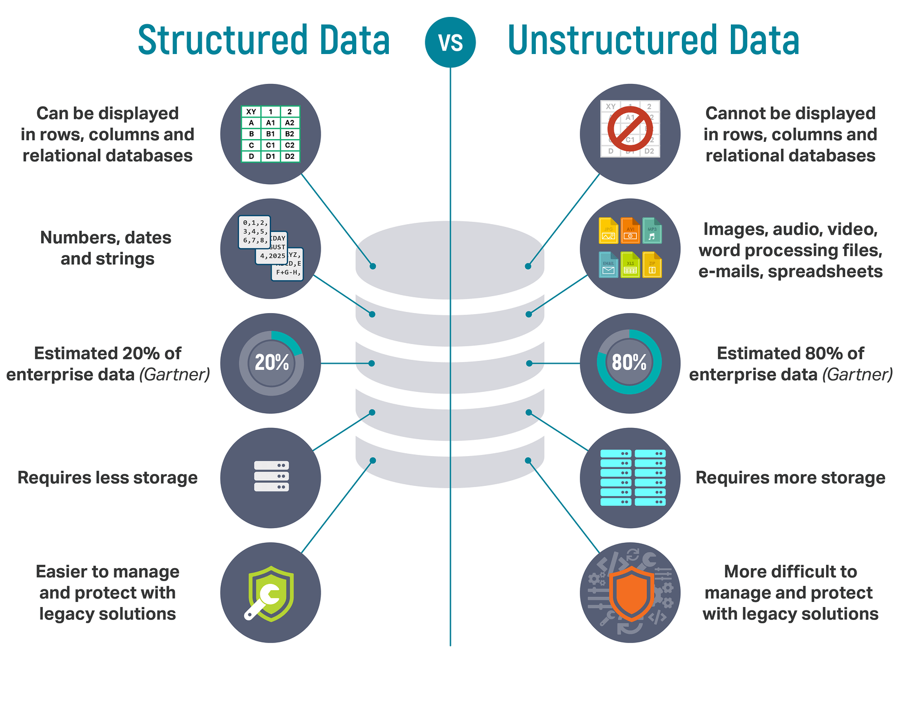

```{r setup, include=FALSE}
knitr::opts_chunk$set(fig.pos = "H", out.extra = "")
```

# Tipos de datos

A efectos de la exploración de los datos y el modelado predictivo, conocer el tipo de los datos con los que estamos trabajando es básico para ayudarnos a determinar cosas tan importantes como el tipo análisis de datos que necesitamos realizar, qué clase de visualización debemos usar o el modelo estadístico que debemos utilizar.

De hecho, los lenguajes de programación usados en ciencia de datos, como R y Python, utilizan estos tipos de datos para mejorar el rendimiento computacional, es decir, el tipo de datos para una variable determina cómo el software manejará los cálculos para esa variable.

Así, los tipos de datos son una forma de clasificación que especifica qué tipo de valor puede almacenar una variable y qué tipo de operaciones matemáticas, relacionales o lógicas se pueden aplicar a la variable sin causar un error. En el aprendizaje automático, es muy importante conocer los tipos de datos apropiados de la variable independiente y dependiente.

Existen dos tipos de datos principales:

* _**Datos cuantitativos o numéricos**_
* _**Datos cualitativos o categóricos**_


## Datos cuantitativos o numéricos

Los _**datos numéricos**_ son aquellos datos que se expresan en una escala numérica por lo que pueden cuantificarse. Intentan encontrar respuesta a preguntas como "cuánto(s)" y "con qué frecuencia". En palabras simples, se pueden expresar usando variables numéricas y representan medidas o conteos.

Algunos ejemplos de datos cuantitativos son el número de goles en un partido de fútbol, la altura de una persona, la temperatura de un objeto...

Pueden ser a su vez de 2 tipos:

* _**Datos discretos**_
* _**Datos continuos**_

### Datos discretos

Los _**datos discretos**_ son datos cuantitativos que pueden tomar solo valores enteros, como recuentos. Los datos discretos tienen valores distintos y separados, no se pueden subdividir en partes más pequeñas sin que pierdan su sentido. Este tipo de datos no se puede medir pero se puede contar y tienen un número limitado de valores posibles.

Los datos discretos son un recuento de la presencia de una característica, resultado, elemento o actividad.

Generalmente se representan usando números enteros.

Ejemplos de este tipo de valores son:

* El número de caras en 100 lanzamientos de moneda
* El número de estudiantes de una clase
* El número de aciertos en un examen de test

```{r datos_discretos, echo=FALSE, fig.cap="Datos discretos", fig.show = "hold", fig.align = 'center', out.width = '100px'}


```

Una variable discreta que toma un número finito de valores se puede tratar como una variable cualitativa, en la que todos los individuos en los que la variable toma un valor determinado forman una categoría.

Por ejemplo, la variable “Número de hijos de una pareja” es cuantitativa discreta (y además toma po- cos valores, quizá quince o dieciséis valores diferentes como máximo). Así, todas las parejas en las que la variable vale 1 constituyen la categoría de las parejas con hijo único, todas las parejas cuya variable vale 2 constituyen la categoría de las parejas con dos hijos, etc.

### Datos continuos

Los _**datos continuos**_ representan datos que pueden medirse y tienen unidades. Los datos continuos se pueden describir utilizando intervalos en la recta numérica real y pueden tomar cualquier valor entre dos números o intervalo. Representan información que puede dividirse en partes más pequeñas y sigue teniendo sentido.

Generalmente se representan usando números decimales o de coma flotante.

Algunos ejemplos son:

* El peso de las personas
* La longitud de una carretera
* La velocidad de un avión
* El tiempo para completar cierto recorrido

```{r datos_continuos, echo=FALSE, fig.cap="Datos continuos", fig.show = "hold", fig.align = 'center', out.width = '100px'}
knitr::include_graphics("img/td_scale.png")

```


## Datos cualitativos o categóricos

Los _**datos categóricos**_ representan características de los datos. No se pueden medir pero sí que nos permiten ordenar la información por categorías, es decir, representan datos que se pueden dividir en grupos. Son datos que pueden tomar solo un conjunto específico de valores que representan un conjunto de categorías posibles.

Algunos ejemplos de datos cualitativos son el color del pelo, el género, las estaciones del año, las provincias, las tallas de la ropa...

Los datos categóricos también pueden tomar valores numéricos, como por ejemplo los códigos postales, pero aquí debemos tener en cuenta que esos números no tienen un significado matemático por lo que no podemos hacer operaciones aritméticas con los datos cualitativos.

En la práctica muchas variables cualitativas se codifican (se asigna un número a cada categoría) para facilitar su estudio. Veremos que la codificación o _encoding_ de los datos cualitativos es un paso de preprocesamiento muy importante porque la gran mayoría de los modelos de aprendizaje automático no pueden manejar este tipo de valores directamente y deben convertirse a tipos numéricos antes de pasárselos a los modelos.

La variable “Tipo de ordenador” tiene un número finito de posibilidades diferentes. Si se asigna un número entero a cada tipo de ordenador posible (por ejemplo, 1 = PC, 2 = Mac, 3 = Otros), obtenemos una codificación numérica que describe la variable que queremos estudiar.

Las variables categóricas generalmente se representan usando cadenas de texto o números enteros.

A su vez pueden ser:

* _**Datos nominales**_
* _**Datos ordinales**_

### Datos nominales

Los _**valores nominales**_ representan unidades discretas y desordenadas y se utilizan para etiquetar variables que no tienen valor cuantitativo. Cuando decimos desordenados hablamos de que los datos nominales que no tienen orden. Por lo tanto, incluso si cambia el orden de los valores para los datos nominales, el significado permanece sin cambios.

Algunos ejemplos de este tipo de datos son:

- Colores: rojo, verde, amarillo, azul, naranja...
- Estado civil: casado, soltero, viudo...
- Provincias: Madrid, Cáceres, Málaga, Cuenca...

```{r datos_nominales, echo=FALSE, fig.cap="Datos nominales", fig.show = "hold", fig.align = 'center', out.width = '100px'}

knitr::include_graphics("img/td_fruit.png")
```

Los datos nominales que contienen solo dos categorías se llaman _**datos dicotómicos**_. Las variables dicotómicas o datos binarios, también llamadas variables indicadoras, son un caso especial dentro de los anteriores que solo tienen 2 valores posibles, como por ejemplo 0/1, verdadero/falso, sí/no, masculino/femenino... Estos se pueden representar además como booleanos (True/False).

```{r datos_dicotomicos, echo=FALSE, fig.cap="Datos dicotómicos", fig.show = "hold", fig.align = 'center', out.width = '100px'}


```

### Datos ordinales

Los _**valores ordinales**_ representan unidades discretas y ordenadas. Tienen al menos tres categorías y son muy similares a los datos nominales, excepto que el orden importa.

Las variables ordinales en ocasiones se representan mediante números. Aunque cuando están en forma numérica podemos calcular promedios como con las variables cuantitativas, estos números tienen una utilidad limitada porque las diferencias entre los rangos pueden no ser constantes.

Por ejemplo, primero, segundo y tercero en una carrera son datos ordinales, pero la diferencia de tiempo entre el primer y el segundo lugar podría no ser la misma que la diferencia entre el segundo y el tercer lugar.

Algunos ejemplos serían:

- Notas de un examen: A, B, C, D, F
- Tallas de ropa: XS, S, M, L, XL, XXL
- Clasificaciones: 1º, 2º, 3º
- Nivel educativo: primaria, secundaria, grado, máster, doctorado

```{r datos_ordinales, echo=FALSE, fig.cap="Datos ordinales", fig.show = "hold", fig.align = 'center', out.width = '100px'}


```

```{r tipos_datos, echo=FALSE, fig.cap="Tipos de datos", fig.align = 'center', out.width = '300px'}

```


## Datos estructurados vs no estructurados

Otras forma de clasificar los tipos de datos es en _**datos estructurados**_ vs _**datos no estructurados**_:

```{r estruct_no_estrct, echo=FALSE, fig.cap="Datos estructurados vs no estructurados", fig.align = 'center', out.width = '300px'}

```

### Datos estructurados

Los _**datos estructurados**_ son datos cuyos elementos están accesibles para un análisis eficaz de forma directa, es decir, se han organizado en un repositorio formateado y representan información altamente organizada, fáctica y precisa. Son datos que han sido predefinidos y formateados a una estructura establecida antes de ser almacenados, por lo que se componen de tipos de datos claramente definidos y precisos con patrones que facilitan la búsqueda.

Suelen presentarse en forma de cadenas de texto, fechas y números y se trata de aquellos datos que se pueden almacenar en una base de datos relacional en forma de tablas con filas y columnas que están conectadas a través de claves relacionales y pueden mapearse fácilmente en campos predefinidos.

De esta manera, los datos estructurados se organizan y registran de manera ordenada, por lo que se pueden encontrar y procesar fácilmente. Siempre que los datos se ajusten a la estructura de la base de datos relacional, podemos buscar fácilmente información específica y distinguir las relaciones entre sus partes. 

Los datos estructurados a menudo se denominan datos cuantitativos, lo que significa que su naturaleza objetiva y predefinida nos permite contar, medir y expresar datos fácilmente en forma de números o elementos textuales que se pueden contar.

El mayor beneficio de los datos estructurados es la facilidad con que los algoritmos de aprendizaje automático pueden utilizarlos. La naturaleza específica y organizada de los datos estructurados permite una fácil manipulación y consulta de los mismos.

Por el contrario, esta estructura predefinida basada en esquemas de datos rígidos también es una de sus principales desventajas, ya que solo se pueden usar para el propósito previsto lo que limita su flexibilidad y casos de uso. Cualquier cambio en los requisitos significa actualizar esos datos estructurados para satisfacer las nuevas necesidades.

Los datos estructurados generalmente se almacenan en _data warehouses_ y normalmente no requieren mucho espacio de almacenamiento. Los _data warehouses_ son almacenes de datos centrales que utilizan las empresas para el análisis y la generación de informes de datos. 
 
### Datos no estructurados

Los _**datos no estructurados**_ son datos que no están organizados o estructurados de una manera predefinida o que no tienen un modelo de datos preestablecido, por lo que no son adecuados para una base de datos relacional convencional y pueden venir en toda una diversidad de formatos.

Son datos almacenados en su formato nativo que no se procesan hasta que se utilizan. Esto permite más casos de uso ya que el propósito de los datos es adaptable y permite preparar y analizar solo los datos necesarios para la tarea a la que nos enfrentamos.

Se componen de datos en los que generalmente no es fácil realizar búsquedas y vienen en una gran variedad de formatos de archivo que incluyen correos electrónicos, imágenes, archivos de audio y vídeo, publicaciones en redes sociales, archivos de texto...

El problema con los datos no estructurados es que los métodos y herramientas tradicionales no se pueden utilizar para analizarlos y procesarlos. Una de las formas de gestionar datos no estructurados es optar por bases de datos no relacionales, también conocidas como NoSQL.

Si es necesario mantener los datos en sus formatos nativos sin procesar para un análisis más detallado se almacenan en _data lakes_, los cuales son repositorios o sistemas de almacenamiento destinados a almacenar grandes volúmenes de datos en bruto en sus formatos nativos.

Los datos no estructurados en ocasiones también se denominan datos cualitativos, en el sentido de que tienen una naturaleza subjetiva e interpretativa que hace que no se puedan manejar con métodos tradicionales y herramientas de análisis de software. Estos datos se pueden categorizar en función de sus características y rasgos.

El mayor inconveniente de los datos no estructurados es que se requiere preprocesar los datos antes de poder usarlos. Así, los datos no estructurados en bruto deben procesarse y manipularse para transformarlos en datos de forma estructurada antes de poder ingestarlos en los modelos de ML.

Se estima que más del 80% de los datos que manejan las empresas están en formato no estructurado.

|  | Datos estructurados | Datos no estructurados |
|---|---|---|
| **Formato** | Tabla (números, fechas y cadenas de texto) | Múltiple (archivos de texto, audio, vídeo, imágenes...) |
| **Modelo de datos** | Predefinido/no flexible | No predefinido/flexible |
| **Naturaleza** | Cuantitativa | Cualitativa |
| **Búsqueda** | Sencilla | Difícil |
| **Bases de datos** | Relacionales | No relacionales |
| **Almacenamiento** | Data warehouses | Data lakes |
| **Espacio de almacenamiento** | Requiere menos | Requiere mucho |

### Datos semiestructurados

Los _**datos semiestructurados**_ son información que no reside en una base de datos relacional pero que tiene algunas propiedades organizativas que facilitan su análisis de modo que, con algunas manipulaciones, pueden almacenarse en bases de datos relacionales.

Los datos semiestructurados contienen etiquetas o elementos de marcado que identifican valores de datos aislados, lo que permite a los analistas de datos realizar la agrupación de la información y determinar las jerarquías.

Estos datos semiestructurados son datos técnicamente estructurados que, sin embargo, no encajan en la estructura formal de una base de datos relacional.

Algunos ejemplos son los archivos en formato XML o JSON.

## Fuentes

- [_Discrete vs. Continuous Data: Differences & Examples_](https://statisticsbyjim.com/basics/discrete-vs-continuous-data/)
- [_Guide to Data Types and How to Graph Them in Statistics_](https://statisticsbyjim.com/basics/data-types/)
- [_Structured Data vs. Unstructured Data: what are they and why care?_](https://lawtomated.com/structured-data-vs-unstructured-data-what-are-they-and-why-care/)
